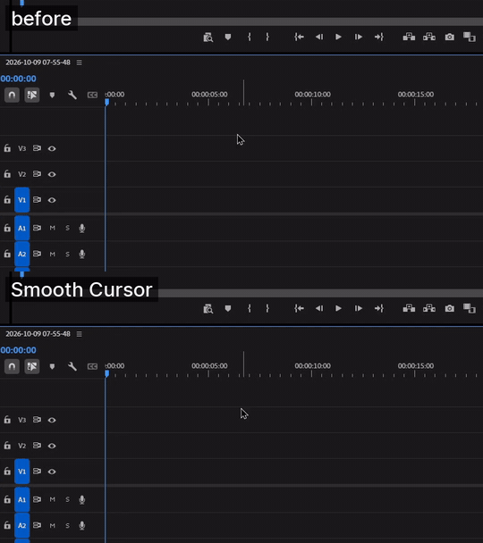

# Smooth Cursor для OBS



Записывает скринкаст через OBS и сам накладывает плавный курсор, как в Screen Studio: дёрганые движения мыши
сглаживаются, клики попадают точно в цель, при нажатии курсор чуть сжимается и наклоняется, на быстрых движениях
появляется motion blur. Автозума нет.

```
F9 (или кнопка) → OBS начинает запись, программа логирует курсор (240 Гц)
F9              → OBS останавливает запись → рядом с видео:
                  <имя>.cursor.json — лог курсора (можно перерендерить с другими настройками)
                  <имя>_smooth.mp4  — готовое видео с плавным курсором
```

## Установка (для всех)

Запустите **`release/SmoothCursor-Setup.exe`** → «Установить». Python не нужен, права администратора тоже:
программа ставится в `%LOCALAPPDATA%\Programs\Smooth Cursor`, появляются ярлыки в «Пуске» и на рабочем столе,
удаляется через «Параметры → Приложения». Нужен только установленный OBS Studio 28+.

При первом запуске откроется настройка: язык (русский / English) → подключение к OBS → экран и fps (кнопка сама
создаст в OBS сцену «Smooth Cursor» с захватом экрана без курсора) → папка записей, ffmpeg (если его нет —
кнопка скачает, ≈100 МБ) и горячая клавиша. Открыть настройку снова — кнопка «Настройка» вверху.

Кодировщик выбирается сам: видеокарта NVIDIA → AMD → Intel, а без них — процессор (медленнее, но работает везде).
Настройки хранятся в `%APPDATA%\SmoothCursor\config.yaml`.

## Обновление

- **С версии 1.1.0** программа сама проверяет обновления при запуске и предлагает обновиться: «Обновить» —
  скачает новую версию, закроется и откроется уже обновлённой.
- **Если стоит 1.0.x:** закройте Smooth Cursor, скачайте `SmoothCursor-Setup.exe` со
  [страницы релизов](https://github.com/fggtf24-cyber/smooth-cursor-obs/releases/latest) и нажмите «Установить» —
  новая версия встанет поверх старой. Удалять старую не нужно, настройки и записи останутся.

**EN:** from 1.1.0 the app checks for updates on start and updates itself. On 1.0.x — close the app, download
`SmoothCursor-Setup.exe` from [Releases](https://github.com/fggtf24-cyber/smooth-cursor-obs/releases/latest) and
install over the old version; settings and recordings are kept.

## Сборка установщика

```bash
pip install -r requirements.txt pyinstaller
python build.py
```

Получится `release/SmoothCursor-Setup.exe` (≈45 МБ): `make_icon.py` рисует иконку, PyInstaller собирает программу,
`installer.py` — сам установщик.

## Запуск из исходников

Двойной клик по **`app.pyw`** (нужны Python 3.11+ и `pip install -r requirements.txt`).

- **Сверху:** кнопка записи (то же, что F9), таймер, состояние OBS и какой монитор будет записан.
- **«Записи»:** записи из папки OBS. «Обзор…» меняет папку, куда OBS сохраняет записи (готовые `_smooth.mp4`
  ложатся туда же). «Рендер» — отрендерить с текущими настройками (можно выбрать несколько),
  «▶ Превью» — отрендерить короткий кусок (с какой секунды и сколько) и сразу открыть: так удобно подбирать
  настройки, не рендеря всё видео. Двойной клик по записи открывает готовое видео.
- **«Пресет ▾»** (вверху, рядом с «Настройка»): Стандарт, Лёгкий, Кино, Без эффектов — сразу выставляет
  сглаживание и эффекты; дальше можно подстроить ползунками (тогда на кнопке — «свой»).
- **«Движение»:** сглаживание траектории.
  - Пружина: «Жёсткость» — насколько быстро курсор догоняет руку (рядом видна задержка в мс),
    «Демпфирование» — 1 без перелёта, меньше — с отскоком.
  - One Euro: почти без задержки, сглаживает в основном медленные движения.
  - «Притяжение к клику» — курсор приходит точно в точку клика, «Мёртвая зона» — гасит дрожание руки.
- **«Курсор и эффекты»:** размер курсора; анимация клика (сжатие, наклон в градусах — минус значит по часовой,
  длительность); motion blur (длина шлейфа в долях кадра, плотность).
- **«Вывод»:** кодек (HEVC или AV1 через NVENC), качество, пресет, сдвиг синхронизации для 30/60 fps, отладка,
  экспорт траектории в CSV, путь к ffmpeg.
- **«OBS и запись»:** подключение, монитор (авто или конкретный), выключение захвата курсора OBS, горячая клавиша.

Все настройки сохраняются сами в `config.yaml` и действуют на следующий рендер или запись. Внизу — прогресс
рендера с кнопкой «Отменить» и лог.

## Настройка OBS (32.x, websocket v5 встроен)

1. **WebSocket:** «Сервис → Настройки сервера WebSocket» → «Включить сервер WebSocket». Порт (по умолчанию 4455)
   и пароль, если включена аутентификация, — на вкладке «OBS и запись».
2. **Сцена:** «Захват экрана» нужного монитора. Программа подстраивается под текущие настройки OBS: профиль,
   разрешение холста и выхода, fps, папку записи — и под то, как захват лежит в сцене (позиция, масштаб,
   «Подогнать к экрану», обрезка, поворот, вложенные сцены и группы): курсор пересчитывается так же, как OBS
   рисует сам источник. Сверху в окне видно, что именно будет записано.
3. **Курсор OBS:** программа сама выключает «Захватывать курсор» в источниках текущей сцены (галка на вкладке
   «OBS и запись»), иначе на видео было бы два курсора.

**Какой монитор пишется.** В режиме «Авто» перед каждой записью программа смотрит текущую сцену OBS и берёт
монитор её «Захвата экрана». Чтобы писать другой монитор, переключите сцену в OBS. Можно и жёстко выбрать монитор
в списке «Дисплей».

## Подстройка синхронизации

Лог курсора привязан к событию OBS «запись началась». Первый кадр видео реально снимается чуть раньше события,
поэтому есть сдвиг. На этой машине замерено: 5120×2160@30 ≈ −50…−60 мс, 1920×1080@60 ≈ −15 мс, от записи
к записи разброс ±6 мс. Для новой конфигурации:

1. Снимите галку «Выключать захват курсора» и включите «Захватывать курсор» в источнике OBS.
2. Запишите 10–20 секунд с быстрыми движениями.
3. Поставьте галку «Отладка» на вкладке «Вывод» и нажмите «Рендер». Получится `<имя>_smooth_debug.mp4`, где поверх
   нарисован реальный курсор из лога (красный).
4. Он должен лежать точно на курсоре OBS. Если красный опережает, уменьшите сдвиг, если отстаёт — увеличьте.

## Консольный режим (без окна)

```bash
python smooth_cursor.py
```

Ждёт F9, пишет и рендерит в фоне; настройки берёт из того же `config.yaml`. Перерендер без окна (можно указать
исходник, готовый `_smooth.mp4` или `.cursor.json` — остальное найдётся рядом):

```bash
python smooth_cursor.py --rerender "C:/Videos/2026-10-09 12-00-00_smooth.mp4"
```

## Как это устроено

- `app.pyw` — окно (tkinter). Запись и рендер идут в фоновых потоках, хоткей — в своём потоке с циклом сообщений.
- `settings.py` — значения по умолчанию; `config.yaml` поверх них.
- `smooth_cursor.py` — OBS (websocket), хоткей, запись; консольный режим.
- `win32cursor.py` — Per-Monitor DPI Aware v2, мониторы, поток-логгер курсора (`GetCursorPos`, `GetCursorInfo`,
  `GetAsyncKeyState`), извлечение текущих системных курсоров в PNG с альфой.
- `smoothing.py` — пружина / One Euro на сетке 1 мс, притяжение к кликам, выборка под кадры видео.
- `render.py` — каждый спрайт (тип курсора × шаг анимации клика, «призраки» шлейфа) — отдельный ffmpeg `overlay`,
  позиции покадрово задаёт `sendcmd`. Декод NVDEC, кодирование NVENC, аудио копируется. На 5K около 55 кадров/с
  на RTX 4060.
- `selftest.py` — проверки без OBS: сглаживание, анимация клика, рендер синтетического 5K-видео обоими кодеками,
  точность превью по времени.

```bash
python selftest.py
```

## Ограничения

- Позиция курсора квантуется до 2 px (overlay в yuv420). На 5K не заметно.
- Монохромные курсоры, инвертирующие фон (классический I-beam), рисуются чёрными с белой обводкой.
- Анимированные курсоры («ожидание») рисуются первым кадром; курсоры, которые приложения рисуют сами, —
  стрелкой.
